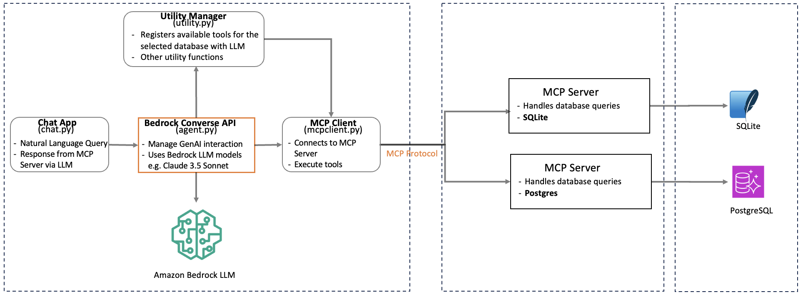

# Amazon Bedrock Converse API and Database MCP Server Integration

This sample demonstrates the integration of AWS Bedrock's Conversational AI capabilities with relational databases through the [Model Context Protocol (MCP)](https://modelcontextprotocol.io/introduction) Server architecture. The sample leverages Bedrock's Converse API to enable natural language interactions with databases in query-only mode, while the MCP Server handles the complexities of database operations and security protocols.




The architecture serves as a reference implementation for developers looking to incorporate Generative AI capabilities into their database applications. While the sample focuses on RDS PostgreSQL & SQLite the pattern can be readily adapted for other database systems that support MCP Server integration. 

This sample demonstrates:

- Integration of RDS PostgreSQL and SQLite with AWS Bedrock's Foundational Models using Model Context Protocol (MCP)
- Bedrock Converse API integration with MCP Server
- Natural language querying of databases (read-only) using Bedrock foundation models
- Secure and efficient database operations through MCP Server
- Adding GenAI capabilities to existing applications
- Foundation for cross-database GenAI solution


## AWS Components
List of AWS resources used in this sample
- **Bedrock Converse API**: enables real-time, conversational experiences by managing context, memory, and state across multiple interactions with foundation models (FMs). [Link](https://docs.aws.amazon.com/bedrock/latest/APIReference/API_runtime_Converse.html)
- **Bedrock Model**: Anthropic Claude Sonnet 3.5 or other LLMs available within Bedrock. [Link](https://docs.aws.amazon.com/bedrock/latest/userguide/models-supported.html)
- **Bedrock Guardrails**: Implement safeguards customized to your application requirements and responsible AI policies. [Link](https://aws.amazon.com/bedrock/guardrails/)
- **RDS Postgres**: Used for querying the database. [Link](https://aws.amazon.com/rds/postgresql/)

## Prerequisite
- An AWS account with AWS Identity and Access Management (IAM) permissions to create an RDS PostgreSQL database
- Access to Bedrock LLMs
- User with [read-only](https://aws.amazon.com/blogs/database/managing-postgresql-users-and-roles/) access to RDS Postgress
- Python installed with the Boto3 library
- An IDE like Visual Studio Code
- SQLite database on the local system
- Download the AWS RDS root certificate from [here](https://truststore.pki.rds.amazonaws.com/global/global-bundle.pem)
- Optionally setup [Bedrock Guardrails](https://docs.aws.amazon.com/bedrock/latest/userguide/guardrails-create.html) to stop DDL queries at the LLM level. This would ensure that no DDL operations are executed in the database even if you have database user allows DDL operation.


## Clone the repo 
```
git clone https://github.com/aws-samples/sample-for-bedrock-integration-with-database-mcp-server
```


## Step 1
### Setup your development environment using say VS Code IDE.

Ensure you have Node.js installed (v10.13.0 or later)

Install AWS CDK
```
npm install -g aws-cdk
```

Configure AWS CLI with your credentials and use [region where Bedrock is available](https://docs.aws.amazon.com/bedrock/latest/userguide/models-regions.html)
```
aws configure
```

Manually create a virtual environment on MacOS and Linux:
```
python3 -m venv .venv
```
Activate your virtual environment

```
source .venv/bin/activate
```

Once the virtual environment is activated, you can install the required dependencies.

```
pip install -r requirements.txt
```

Install the PostgreSQL MCP server using npm:
```
npm install -g @modelcontextprotocol/server-postgres

pip install mcp psycopg2-binary

```

## Bedrock Access
The user must have access to Bedrock model being used for the sample. This sample isassuming the following setup
- Region: This is setup in [agent.py](src/agent.py) from your AWS session
- LLM: us.anthropic.claude-3-5-sonnet-20240620-v1:0 #Using cross-region inference in **mcpmain.py**. In case, cross-region not required, please use the [LLM endpoint](https://docs.aws.amazon.com/general/latest/gr/bedrock.html) instead.

## Step 2: RDS Postgres Setup and Access
### Create and setup RDS
Change **[dbconfig.ini](src/config/dbconfig.ini)** file with the following information
- db_user = "xxx"
- db_password = "xxx" //This has been removed from the file for security reason. Make sure to add this back
- db_host = "xxx.us-east-1.rds.amazonaws.com"
- db_port = "5432"
- db_name = "xxx"
- ssl_cert_path = "/xxx/global-bundle.pem" //location of the .pem file


## Step 3: Run the application and query your configured database using natural language
Run with appropriate database type option. If no database type provided, chat session will assume SQLite as the default database and will create a database within src/data folder with the name mymcpdb.db. You can point to your existing SQLite database by modifying [this file](src/config/database_config.py)

```
python3 chat.py --db-type [sqlite / postgres]

```

Ask questions like: (the database user has the permission to perform those actions in the database)

- List all products that are available in products table
- List of products which cost above 50.00

## Cost of running this sample
The following services will incur costs based on the usages and uptime. Please delete/disable access to this resources as needed at the end.
- RDS Postgres database (https://aws.amazon.com/rds/postgresql/pricing/)
- Bedrok Claude [Model invoke API](https://aws.amazon.com/bedrock/pricing/)
- Bedrock [Guardrail](https://aws.amazon.com/bedrock/pricing/)


## Additional information

### Sample RDS Postgres tables and data for testing. This is just for quick test. 
The database user configured must have enough privilege to perform those operations. As this samples works only for read-only instructions, these operations have to be excuted outside of this samples using a database tool

CREATE TABLE users (
    id SERIAL PRIMARY KEY,
    name VARCHAR(255) NOT NULL,
    email VARCHAR(255) UNIQUE NOT NULL,
    created_at TIMESTAMP WITH TIME ZONE DEFAULT CURRENT_TIMESTAMP
);

INSERT INTO users (name, email) VALUES
    ('John Doe', 'john.doe@example.com'),
    ('Jane Smith', 'jane.smith@example.com'),
    ('Bob Wilson', 'bob.wilson@example.com'),
    ('Alice Johnson', 'alice.j@example.com'),
    ('Tom Brown', 'tom.brown@example.com');

CREATE TABLE products (
    product_id SERIAL PRIMARY KEY,
    name VARCHAR(255) NOT NULL,
    price DECIMAL(10,2) NOT NULL
);

INSERT INTO products (name, price) VALUES
    ('Amazon Echo Dot (5th Gen)', 49.99),
    ('Kindle Paperwhite 8GB', 139.99),
    ('Fire TV Stick 4K', 49.99),
    ('Ring Video Doorbell', 99.99),
    ('Amazon Smart Plug', 24.99);
    